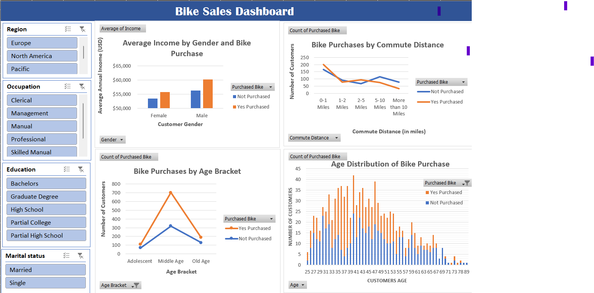

# 🚴‍♂️ Bike Sales Dashboard – Excel Project

## 📌 Project Overview
This project analyzes **bike purchase behavior** across customer demographics and lifestyle factors such as **age, gender, income, education, occupation, commute distance, and region**.  
The goal is to build an **interactive Excel dashboard** to uncover insights into who is more likely to purchase bikes and why.

https://github.com/user-attachments/assets/f1f1a829-d75a-4a3a-beb2-a68213e285b2

---

## 🛠️ Tools Used
- Microsoft Excel  
  - Data Cleaning & Transformation  
  - Pivot Tables & Pivot Charts  
  - Slicers for interactivity  
  - Dashboard creation  

---

## 📊 Data Cleaning Steps
1. Standardized gender values: `M/F → Male/Female`  
2. Created a new column **Purchased Bike** (Yes / Not Purchased).  
3. Removed duplicates and handled blanks.  
4. Standardized formats:  
   - Age → Numeric  
   - Income → USD (currency format)  
   - Commute Distance → Grouped in miles  
5. Structured dataset for pivot analysis.  

---

## 📈 Dashboard Highlights
The dashboard includes 4 main visuals:

1. **Average Income by Gender and Bike Purchase**  
   - Male and Female income compared for Purchased vs Not Purchased.  
   - Clear income difference between buyers and non-buyers.  

2. **Bike Purchases by Commute Distance**  
   - Customers with **shorter commute distances (0–1 miles, 2–5 miles)** are more likely to purchase bikes.  
   - Longer commutes (>10 miles) show a sharp drop in bike purchases.  

3. **Bike Purchases by Age Bracket**  
   - Middle-aged customers show the highest likelihood of purchasing.  
   - Adolescent and older customers have significantly fewer purchases.  

4. **Age Distribution of Bike Purchases**  
   - Purchases peak between ages **35–45**.  
   - Bike buying declines after age 55.  

---

## 📂 Repository Structure

bike-sales-dashboard/
│── data/

│ └── bike_sales_cleaned.csv

│── dashboard/

│ └── bike_sales_dashboard.xlsx

│── images/

│ └── dashboard_screenshot.png

│── README.md

│── Summary_Report.pdf

---

## 🔑 Key Insights
- **Middle Age group (31–54 years) is the primary buyer segment**, contributing the most bike purchases.  
- **Adolescents (≤30 years) and Old Age (≥55 years)** groups show fewer purchases.  
- **Higher annual income** correlates with higher bike purchases across all demographics.  
- **Short-distance commuters (0–5 miles)** are much more likely to purchase bikes.  

---

## 🚀 How to Use
1. Download the Excel file from `/dashboard/bike_sales_dashboard.xlsx`.  
2. Open the **Dashboard** sheet.  
3. Use slicers (Region, Occupation, Education, Marital Status) to filter and explore insights.  

---

## 📷 Dashboard Preview

---

## 📌 Summary
This project demonstrates how **Excel can be used for real-world business intelligence** through data cleaning, pivot analysis, and dashboard creation.  
The findings highlight **demographic and lifestyle factors** that influence bike sales, helping businesses tailor marketing strategies more effectively.  
